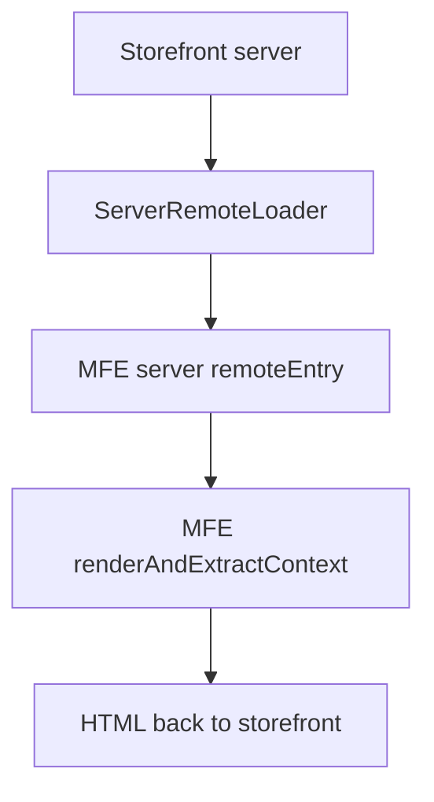
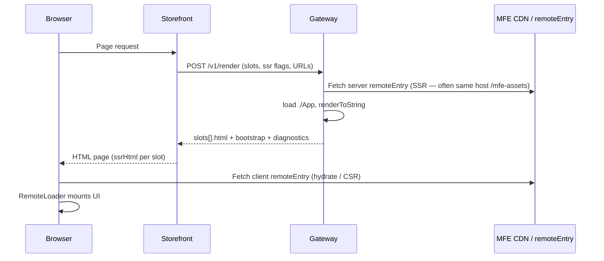
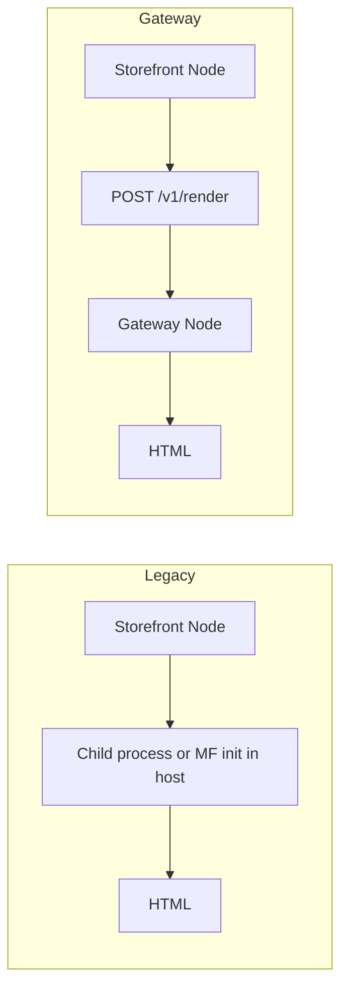
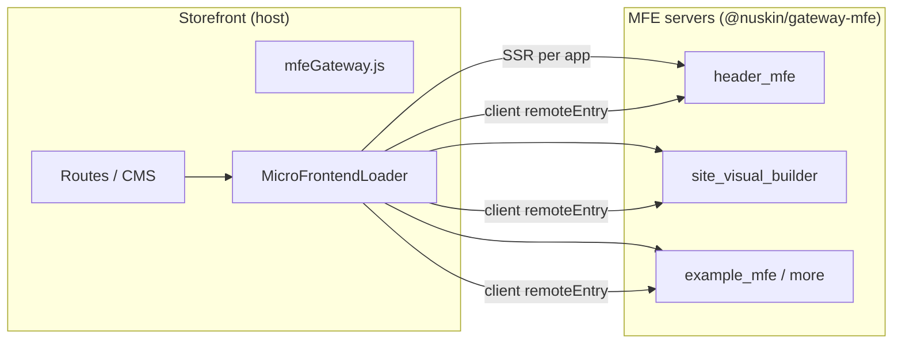
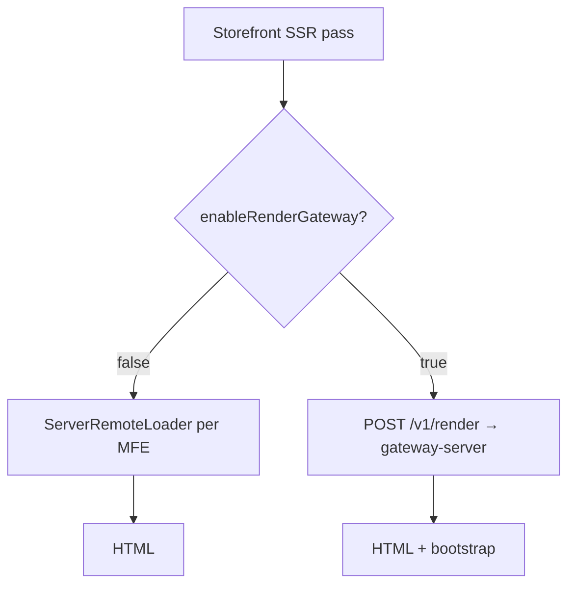
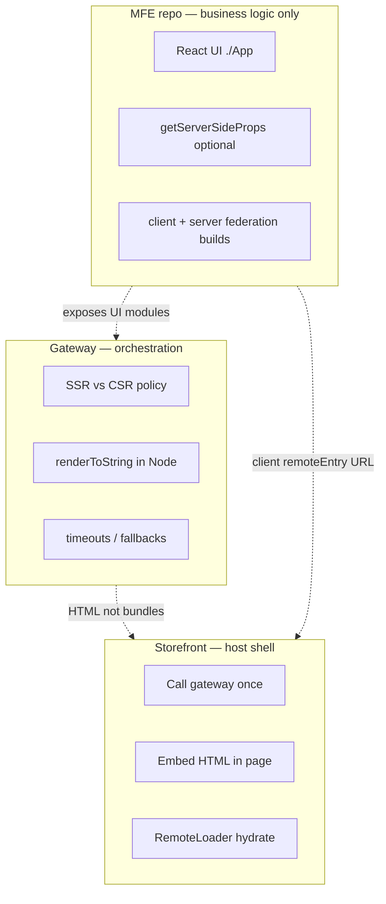
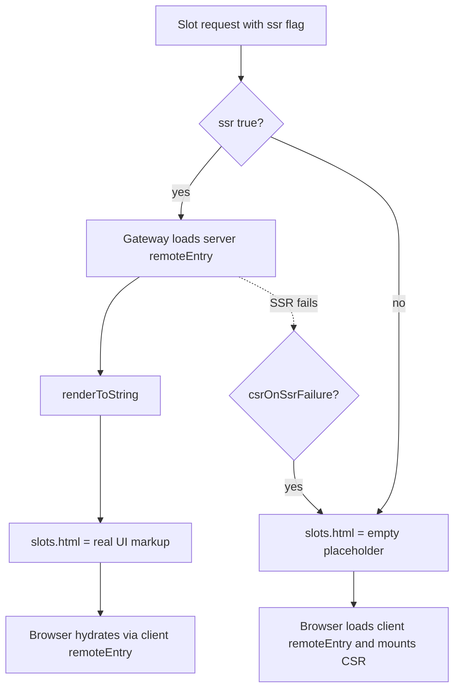
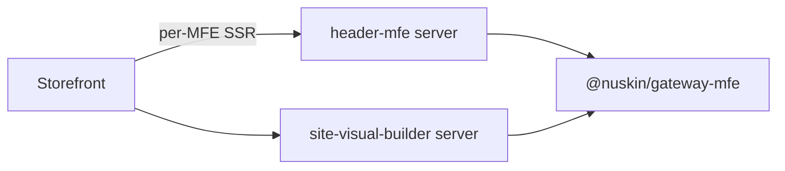
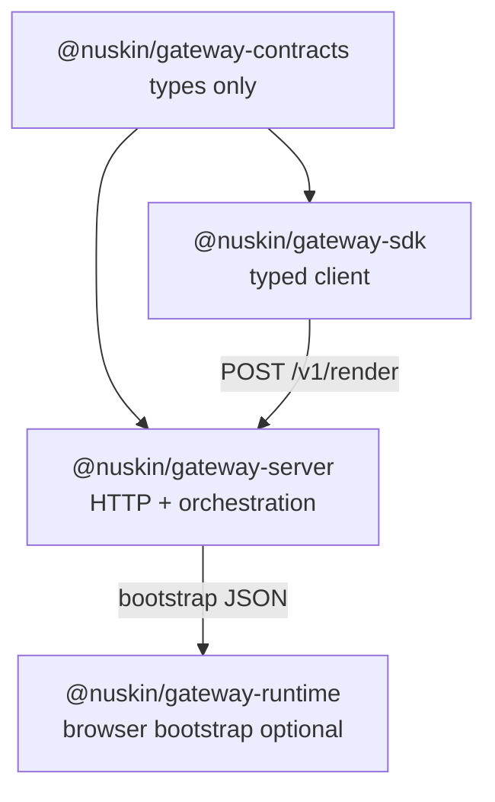

# MFE Utils

Shared Nu Skin MFE packages, including the render gateway for SSR/CSR orchestration during the monolith → MFE migration.

**Related repos:** [storefront](../storefront), [header-mfe](../header-mfe), [site-visual-builder](../site-visual-builder)

---

## Background

NuSkin’s storefront is a large Next.js-style host that composes multiple micro-frontends (header, site visual builder, and more over time). Each MFE ships its own UI via **Module Federation** and historically ran its own **server-side render path** (Express + `renderAndExtractContext` or equivalent).

As more MFEs are added, rendering logic, SSR flags, timeouts, and failure handling spread across the host and every MFE repo. That makes the migration harder to reason about, test, and operate in production.

---

## The problem (before)

| Pain point | What happened |
|------------|----------------|
| **Rendering logic in the host** | Storefront’s `ServerRemoteLoader` knew how to load each remote, call MFE-specific SSR entrypoints, and stitch HTML. Every new MFE added host-side branching. |
| **Duplicated SSR contracts** | Each MFE could expose different federation surfaces (`renderAndExtractContext`, custom adapters, SEO hooks). The host had to understand each one. |
| **No single place for policy** | SSR vs CSR, timeouts, fallbacks, and “degrade to CSR on failure” lived in scattered config and code—not one orchestration layer. |
| **Hard to add MFEs safely** | Registering a MFE meant touching storefront loaders, ContentStack config, and often MFE-specific server code. |
| **Operational blind spots** | No dedicated service for health checks, manifest inspection, or compose diagnostics across slots on one request. |

**Legacy flow (still available when the flag is off):**



This works today but does not scale cleanly as the number of MFEs and slots grows.

---

## What this solves

The **Render Gateway** is a dedicated service that owns **when and where** MFEs render. MFEs keep owning **what** renders (React UI).

| Concern | Owner |
|---------|--------|
| UI components, styling, business UI | **MFE** (`./App`, `./Home`) |
| Data for SSR (optional) | **MFE** (`getServerSideProps` on exposed module) |
| SSR vs CSR per slot | **Gateway** (manifest + request overrides) |
| Loading remotes, `renderToString`, timeouts | **Gateway** |
| Composed slot HTML + client bootstrap JSON | **Gateway** |
| Page routing, CMS, cookies, locale | **Storefront** (unchanged) |

**Gateway flow (flag on):**



### Concrete benefits

1. **One integration point on storefront** — `config/mfeGateway.js` maps gateway output to the same `mfeServerData` shape the existing `MicroFrontendLoader` already expects. Minimal host changes; flag toggles legacy vs gateway.
2. **MFEs stay independent** — MFE repos still ship their own UI and federation builds. For local gateway dev you **build** artifacts once; the gateway serves them at `/mfe-assets` (no per-MFE Node SSR server in the render path).
3. **Central adapters** — Gateway registers how to render each `mfeId` in one repo (`gateway-server`), not copy-paste `mfe-adapter.js` into every MFE.
4. **Composable slots** — One request can render header + main content in parallel with per-slot SSR/CSR and diagnostics.
5. **ContentStack URLs still win** — Storefront sends live `remoteEntry` URLs per request; gateway merges them over static manifest defaults.
6. **Safe rollout** — `enableRenderGateway: false` keeps the legacy path unchanged for markets or envs not ready yet.

### What this does *not* replace (yet)

- Storefront routing, auth, or CMS
- MFE UI development in isolation (optional `yarn dev` in header-mfe / site-visual-builder when editing that MFE alone)
- Client hydration via existing `RemoteLoader` (optional `@nuskin/gateway-runtime` later)
- Production CDN manifest / K8s deploy (follow your platform standards)

---

## Performance vs legacy (`ServerRemoteLoader`)

Comparison of the **gateway path** (`enableRenderGateway: true`) vs the **existing storefront path** (`ServerRemoteLoader` / child-process SSR).

### At a glance

| Area | Legacy (storefront) | Gateway path |
|------|---------------------|--------------|
| Where SSR runs | Storefront Node (often **child process** per MFE) | Dedicated **gateway** service |
| Multi-MFE per page | `Promise.all` in `mfeServer.js` | `Promise.all` per slot in `compose()` |
| Storefront process load | High (MF init, remote fetch, SSR in host) | Lower (one HTTP call + embed HTML) |
| MFE Express SSR server | Child / remote may run full server render | **Not called** — UI + `getServerSideProps` only |
| Extra network hop | None (in-process) | Yes (storefront → gateway → MFE CDN) |
| Client hydration | `RemoteLoader` | **Unchanged** |

### Host SSR: before vs after



### What the gateway improves

#### 1. Lighter storefront SSR (main win)

**Before:** `ServerRemoteLoader` runs Module Federation inside the storefront SSR process, or spawns a **child Node process** per MFE (default ~10s timeout, spawn + IPC).

**After:** Storefront calls `POST /v1/render` once and maps JSON. Federation and `renderToString` run in the gateway.

**Effect:** Less CPU/memory on storefront workers; fewer child-process spawns; storefront TTFB less likely blocked by slow MFE remotes.

#### 2. One compose for multiple MFEs

**Before:** Each app runs a full loader stack (probe, revalidate, init, load) in the host.

**After:** One request; gateway renders slots in parallel with shared manifest merge and per-slot timeouts (`manifest.defaults.timeoutMs`, typically 8s).

**Effect:** Storefront pays one orchestration cost; parallel slots with isolated failure handling.

#### 3. Less work per SSR request

**Before:** Path may invoke heavy MFE server rendering (`renderAndExtractContext` / full server bundle).

**After:** Gateway loads UI only (`./App` / `./Home`), optional `getServerSideProps`, then `renderToString`.

**Effect:** No second hop to each MFE’s Express SSR service. MFE ContentStack/API time is unchanged; orchestration overhead is lower.

#### 4. Centralized timeouts and fallbacks

**Before:** Child timeout and per-app errors inside storefront SSR.

**After:** Per-slot timeout + `csrOnSsrFailure` in manifest — slow MFE can degrade to CSR placeholder without blocking sibling slots.

#### 5. Warm federation reuse

Gateway tracks `initializedRemotes` so the same `mfeId` is not re-initialized on every compose on a warm instance.

**Effect:** Faster subsequent composes vs cold child-process SSR per request.

#### 6. Operational scale (indirect)

- Scale gateway replicas independently of storefront
- MFE load does not scale 1:1 with every storefront pod
- Failures contained in gateway tier

Improves **p99 under load** and stability, not only single-request milliseconds.

#### 7. Preserved client optimization

Both paths embed `_clientRemoteConfig` in `mfeServerData` so the browser can hydrate without an extra ContentStack round-trip before loading the remote.

### What is not solved (same or tradeoff)

| Topic | Notes |
|-------|--------|
| **MFE data latency** | `getServerSideProps` still calls ContentStack/APIs — same duration as legacy |
| **Client TTI / hydration** | Still `RemoteLoader` + client `remoteEntry` |
| **Bundle / CDN** | No composed-HTML edge cache by default |
| **Federation errors** | Remote/plugin failures can still fail SSR locally |
| **Extra hop** | Storefront → gateway adds latency unless colocated (same cluster/VPC) |

### User-visible impact

| User-visible | Legacy | Gateway |
|--------------|--------|---------|
| First paint (SSR HTML) | Storefront waits for all in-process MFE loaders | Storefront waits for **one** gateway round-trip |
| Header + VB same page | Parallel but heavy on host | Parallel in gateway, **lighter on host** |
| Slow header MFE | Can block storefront SSR worker | Can block gateway; storefront less affected |
| CSR-only MFE | Placeholder + client fetch | Same |
| Warm instances | Host remote cache ~10 min; child per SSR | Gateway reuses federation init |

### Performance summary

| Improved | Not improved (without further work) |
|----------|-------------------------------------|
| Storefront SSR CPU/memory | MFE business/data fetch time |
| Multi-MFE orchestration on host | Client bundle load and hydrate |
| Avoid MFE Express SSR hop | CDN caching of composed HTML |
| Central timeouts / CSR fallback | Zero network hop (deploy gateway nearby) |
| Independent scaling of render tier | Per-request child isolation (gateway uses shared process — usually faster) |

**Bottom line:** The gateway mainly improves **storefront SSR performance and reliability** when multiple MFEs are on a page. It does not automatically make each MFE’s data layer faster. Deploy gateway **close to storefront** (same region/VPC) to limit added latency from the compose HTTP call.

---

## Design principles

1. **Library in each MFE** — `@nuskin/gateway-mfe` exports `renderAndExtractContext`; no central gateway process.
2. **MFEs expose UI** — Federation `./App` + optional `getServerSideProps` on the same module.
3. **Storefront unchanged** — Per-MFE SSR calls; `ssrHtml` + `_clientRemoteConfig` shape preserved.
4. **Types at the boundary** — `@nuskin/gateway-contracts` for `RenderContext` / `MfeRenderResult`.
5. **Optional compose** — `@nuskin/gateway-server` multi-slot `compose()` for tests only (no HTTP server).

---

## Architecture

### System overview



### Feature flag: two paths



### Who owns what (standalone MFE intent)



### SSR vs CSR per slot



| Layer | Responsibility |
|-------|----------------|
| **Storefront** | Routes, CMS, feature flags, `mfeGateway.js` bridge |
| **Gateway** | SSR vs CSR, composition, adapters, assets/bootstrap |
| **MFE** | UI, optional data fetch for SSR, standalone dev server |

---

## Packages

| Package | README | Purpose |
|---------|--------|---------|
| `@nuskin/gateway-contracts` | [packages/gateway-contracts/README.md](packages/gateway-contracts/README.md) | Shared TypeScript types |
| `@nuskin/gateway-mfe` | [packages/gateway-mfe/README.md](packages/gateway-mfe/README.md) | **Install in each MFE** — SSR library |
| `@nuskin/gateway-server` | [packages/gateway-server/README.md](packages/gateway-server/README.md) | Optional `compose()` for tests (no HTTP app) |
| `@nuskin/gateway-sdk` | [packages/gateway-sdk/README.md](packages/gateway-sdk/README.md) | Typed HTTP client (optional for storefront) |
| `@nuskin/gateway-runtime` | [packages/gateway-runtime/README.md](packages/gateway-runtime/README.md) | Browser hydrate/mount (optional) |
| `@nuskin/mfe-branch-picker` | [packages/mfe-branch-picker/README.md](packages/mfe-branch-picker/README.md) | Preview branch store + picker UI (Visual Builder hosts) |
| `@nuskin/mfe-contentstack` | [packages/mfe-contentstack](packages/mfe-contentstack) | Shared Contentstack stack, live preview, and `getContent` |
| `@nuskin/mfe-examples` | [packages/mfe-examples/README.md](packages/mfe-examples/README.md) | Demo MFEs (inline SSR + client bundles on gateway) |

Manifest config: [manifests/README.md](manifests/README.md).

**Examples & storefront wiring:** [examples/README.md](examples/README.md) · [examples/STOREFRONT_INTEGRATION.md](examples/STOREFRONT_INTEGRATION.md)

---

## Library-only (no gateway app)

SSR lives in **each MFE** via [`@nuskin/gateway-mfe`](packages/gateway-mfe). There is **no** standalone Express service — not in production, **not for local dev**.



| Repo | Installs gateway? |
|------|-------------------|
| **header-mfe, site-visual-builder, …** | Yes — `createMfeRenderer()` in server bundle |
| **storefront** | No — legacy `ServerRemoteLoader` / MFE URLs |
| **this monorepo** | Source for packages; `yarn dev` runs **example MFE** dev server only |

### Quick start (examples)

```bash
yarn install
yarn build
yarn dev   # mfe-examples on http://localhost:5510 — uses gateway-mfe library
```

Sibling MFEs: `yarn dev:build-mfes` then `yarn start` in header-mfe / site-visual-builder (each MFE’s own server).

---

## Quick start (integrate into your MFE)

```bash
yarn add @nuskin/gateway-mfe
```

See [packages/gateway-mfe/README.md](packages/gateway-mfe/README.md) and [examples/README.md](examples/README.md).

```bash
curl -s http://localhost:5510/health
curl -s 'http://localhost:5510/ssr/example_mfe?url=/us/en/demo'
```

---

## Storefront integration (minimal)

In `storefront/config/appConfig/defaultConfig.json` (or ContentStack):

```json
"enableRenderGateway": "true",
"enableHeaderMFE": "true",
"renderGatewayUrl": "http://localhost:3100"
```

| Flag | Effect |
|------|--------|
| `enableRenderGateway: false` | Legacy `ServerRemoteLoader` — **no gateway dependency** |
| `enableRenderGateway: true` | `config/mfeGateway.js` → `POST /v1/render` |

**Storefront touchpoints:**

| File | Role |
|------|------|
| `config/mfeServer.js` | If flag on → `getMicroFrontendAppsViaGateway()` |
| `config/mfeGateway.js` | Build compose request, map response to legacy `mfeServerData` |
| `MicroFrontendLoader.jsx` | Unchanged hydration via `RemoteLoader` + `./App` |
| `serverConfig.js` | Multi-MFE `mfeServerDataByApp` when several slots render |

**Local dev:** Run gateway (`yarn dev` in this repo) and storefront with the flag on. MFE remotes must be reachable at URLs from ContentStack or manifest defaults.

---

## Registering a new MFE

1. Copy [examples/minimal-mfe](examples/minimal-mfe) or follow [examples/STOREFRONT_INTEGRATION.md](examples/STOREFRONT_INTEGRATION.md).
2. **MFE repo** — Federation `name` matches ContentStack `app_name`; expose `./App` (+ optional `getServerSideProps`).
3. **Manifest** — `manifests/manifest.dev.json`
4. **Gateway** — `packages/gateway-server/src/adapters/registry.ts`
5. **Storefront** — ContentStack + `MicroFrontendLoader` (per-app checklist in examples doc)

Details: [packages/gateway-server/README.md#register-a-new-mfe](packages/gateway-server/README.md#register-a-new-mfe).

Verify: `curl http://localhost:3100/v1/adapters`

---

## Migration checklist

- [ ] Gateway deployed and reachable from storefront (`renderGatewayUrl`)
- [ ] Manifest includes all production MFEs (or rely on ContentStack-only URLs)
- [ ] Enable flag in lower env → smoke test header + SVB pages
- [ ] Compare SSR HTML and client hydration vs legacy path
- [ ] Monitor `diagnostics` on compose responses
- [ ] Roll out per market; keep `enableRenderGateway: false` as rollback

---

## Environment

| Variable | Default |
|----------|---------|
| `PORT` | `3100` |
| `GATEWAY_MANIFEST_PATH` | `manifests/manifest.dev.json` (via dev script) |
| `GATEWAY_DEBUG` | Log federation warnings when `true` |
| `RENDER_GATEWAY_URL` | Storefront override for gateway base URL |

---

## Monorepo scripts

```bash
yarn build      # Build all packages
yarn dev        # Start mfe-examples on :5510
yarn typecheck  # Typecheck all packages
```

---

## Package map



---

## FAQ

**Why not call each MFE’s Express SSR server from the gateway?**  
That couples gateway uptime to N MFE server deployments and duplicates process boundaries. Loading UI + `getServerSideProps` via federation keeps MFE standalone servers for dev only.

**Do we have to use `gateway-runtime` on the client?**  
No. Storefront keeps using `RemoteLoader` with `_clientRemoteConfig.component: 'App'`.

**What if the gateway is down?**  
Today: enable the flag only when the service is available, or keep the flag off for legacy. A future improvement is automatic fallback in `mfeGateway.js` to `ServerRemoteLoader`.

**Can one page render multiple MFEs?**  
Yes. Compose accepts multiple `slots`; storefront maps them via `mfeServerDataByApp` when more than one MFE is active on a route.
