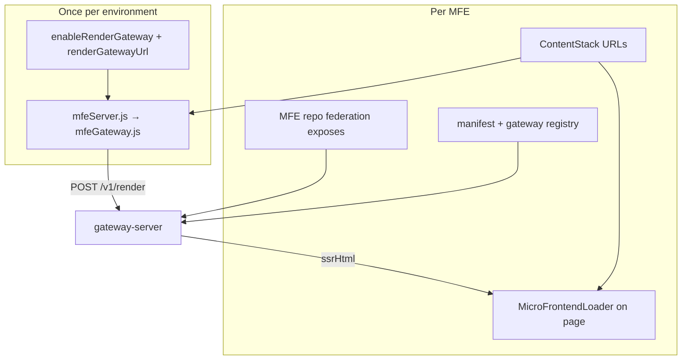

# Storefront integration per MFE

What to change in each repo when wiring an MFE through the Render Gateway.



**Global storefront setup (once per environment):**

| File | Change |
|------|--------|
| `config/appConfig/defaultConfig.json` | `"enableRenderGateway": "true"`, `"renderGatewayUrl": "http://localhost:3100"` |
| `config/mfeServer.js` | Already delegates to gateway when flag is on — **no change per MFE** |
| `config/mfeGateway.js` | Shared bridge — **no change per MFE** unless custom SSR rules (see header) |

---

## 1. `header_mfe`

Production MFE: [header-mfe](../../header-mfe) (sibling repo).

### MFE repo

| Item | Value |
|------|--------|
| Federation `name` | `header_mfe` (must match ContentStack `app_name`) |
| Exposes | `./App`, `./Header` → header UI |
| Optional | `getServerSideProps` on `./App` module for SSR data |
| Standalone dev | `yarn start` → remote on port **5501** |

No `mfe-adapter.js` in the MFE. Gateway renders UI via federation.

### Gateway repo

| File | Status |
|------|--------|
| `manifests/manifest.dev.json` | Entry `header_mfe` (port 5501) |
| `packages/gateway-server/src/adapters/registry.ts` | `createHeaderMfeAdapter` |
| `packages/gateway-server/src/adapters/header-mfe.ts` | Uses `./App`, maps `locale` + `params` |

### Storefront changes

| # | File | Required? | What to do |
|---|------|-----------|------------|
| 1 | `config/appConfig/defaultConfig.json` | Yes | `"enableHeaderMFE": "true"` |
| 2 | `config/appConfig/defaultConfig.json` | For gateway | `"enableRenderGateway": "true"` |
| 3 | `src/routes/routes.js` | Yes | Renders `<HeaderMFE />` when `enableHeaderMFE()` |
| 4 | `src/views/components/Header/HeaderMFE/HeaderMFE.jsx` | Yes | `MicroFrontendLoader` with `appName: 'header_mfe'`, `component: 'App'` |
| 5 | ContentStack | Yes | `microfrontend_config` entry for `header_mfe` (client + server URLs) |
| 6 | `config/mfeGateway.js` | Optional | `resolveSsrFlag` already SSRs header when `enableHeaderMFE()` |
| 7 | `MicroFrontendLoader.jsx` | No | Uses `mfeServerData` or `mfeServerDataByApp.header_mfe` automatically |
| 8 | `config/serverConfig.js` | No | Picks up SSR via `loadMfeConfig` from loader on server pass |

**SSR registration:** On server render, `MicroFrontendLoader` calls `context.loadMfeConfig({ remoteConfig, isToEnableSSR, params })` when no preloaded data. Header is included in `getServerMfeConfigs()` → gateway compose.

**Client hydration:** `_clientRemoteConfig.component: 'App'` from gateway response; `RemoteLoader` loads `./App`.

### Verify

```bash
# header-mfe running on 5501, gateway on 3100
curl -s -X POST http://localhost:3100/v1/render \
  -H 'Content-Type: application/json' \
  -d @examples/compose-header-only.json | jq '.slots[0].mode'
```

---

## 2. `site_visual_builder`

Production MFE: [site-visual-builder](../../site-visual-builder).

### MFE repo

| Item | Value |
|------|--------|
| Federation `name` | `site_visual_builder` |
| Exposes | `./App`, `./Home` |
| Gateway SSR | Uses **`./Home`** (not `./App`) |
| Standalone dev | Port **5500** |

### Gateway repo

| File | Status |
|------|--------|
| `manifests/manifest.dev.json` | Entry `site_visual_builder` |
| `packages/gateway-server/src/adapters/site-visual-builder.ts` | `uiExpose: "Home"`, props `{ params: { vbResponse, ... } }` |

### Storefront changes

| # | File | Required? | What to do |
|---|------|-----------|------------|
| 1 | ContentStack page entry | Yes | `microFrontend` block: `microfrontendApp: site_visual_builder`, `enableServerRendering` as needed |
| 2 | `src/views/pages/NotFound/ContentStackPage.jsx` | Yes | Maps CS entries → `MicroFrontendLoader` (already generic) |
| 3 | `component` in CS / loader | Yes | Use **`Home`** for VB pages if matching gateway adapter (or `App` for client-only CSR) |
| 4 | `config/appConfig/defaultConfig.json` | For gateway | `enableRenderGateway` + `renderGatewayUrl` |
| 5 | `config/serverConfig.js` | No | Prefers `site_visual_builder` as primary `mfeServerData`; sets `mfeServerDataByApp` when multiple MFEs |
| 6 | `src/views/pages/NotFound/NotFound.jsx` | No | Fallback `mfeServerDataByApp.site_visual_builder` for 404 flow |
| 7 | Dedicated JSX wrapper | No | CS-driven via `ContentStackPage` |

**Important:** Gateway SSR loads `./Home`. Client `RemoteLoader` uses `remoteConfig.component` from ContentStack (often `App` or `Home`). Keep CS `microFrontendComponent` aligned with what the client remote exposes.

### Verify

```bash
# site-visual-builder on 5500, gateway on 3100
curl -s -X POST http://localhost:3100/v1/render \
  -H 'Content-Type: application/json' \
  -d '{"url":"/us/en/page","locale":{"market":"us","language":"en"},"slots":[{"slotId":"main-content","mfeId":"site_visual_builder","ssr":true,"loaderIndex":0}]}' \
  | jq '.slots[0]'
```

---

## 3. `example_mfe` (minimal example)

Runnable demo in [minimal-mfe](./minimal-mfe/). Use this as a template for **new** MFEs.

### MFE repo (`examples/minimal-mfe`)

| Item | Value |
|------|--------|
| Federation `name` | `example_mfe` |
| Exposes | `./App` |
| `getServerSideProps` | Demo: returns `{ greeting }` |
| Port | **5510** |

### Gateway repo

| File | Action |
|------|--------|
| `manifests/manifest.dev.json` | `example_mfe` block (port 5510) |
| `packages/gateway-server/src/adapters/registry.ts` | `createGenericUiAdapter({ mfeId: "example_mfe", uiExpose: "App" })` |

### Storefront changes (to use on a real page)

| # | File | Required? | What to do |
|---|------|-----------|------------|
| 1 | ContentStack `microfrontend_config` | Yes | Add app `example_mfe` with client/server `remoteEntry` URLs |
| 2 | Page or component | Yes | Add `MicroFrontendLoader` (see snippet below) |
| 3 | `config/appConfig/defaultConfig.json` | Yes | `enableRenderGateway: true` |
| 4 | `config/mfeGateway.js` | Only if custom SSR rule | Default: SSR when `isToEnableSSR: true` on loader |
| 5 | `config/serverConfig.js` | No | Works via `loadMfeConfig` like other MFEs |
| 6 | `mfeServer.js` / `mfeGateway.js` | No | Shared code |

**Example page snippet:**

```jsx
import { MicroFrontendLoader } from 'src/views/components/MicroFrontends/MicroFrontendLoader'

<MicroFrontendLoader
  loaderId="mfe-loader-0-example_mfe"
  remoteConfig={{ appName: 'example_mfe', component: 'App' }}
  params={{ url: '/us/en/demo' }}
  isToEnableSSR={true}
/>
```

**Optional feature flag** (recommended for rollout):

```json
"enableExampleMFE": "false"
```

Wrap the loader in `enableNewFeature('enableExampleMFE')` like other MFEs.

### Verify (no storefront)

```bash
cd examples/minimal-mfe && yarn install && yarn build && yarn start
curl -s -X POST http://localhost:3100/v1/render \
  -H 'Content-Type: application/json' \
  -d @examples/compose-example-mfe.json | jq .
```

---

## 4. `complex_demo_mfe` (complex example)

Runnable app: [complex-mfe](./complex-mfe/) — catalog UI with **useReducer** state, **wishlist/compare/filters**, and **getSEOTags**.

### MFE repo (`examples/complex-mfe`)

| Export | Role |
|--------|------|
| `getServerSideProps` | Returns `{ initialState, seo, url, isPageFound }` |
| `getSEOTags` | `<title>`, meta, canonical, OG, JSON-LD (SSR + client Helmet) |
| `App` | `CatalogProvider` + interactive grid |

### Gateway

- `render-ui.ts` calls `getSEOTags` and sets `result.head` (inlined into storefront `ssrHtml`).
- Registry: `complex_demo_mfe` in `adapters/registry.ts`.
- Manifest port **5512**.

### Storefront

```jsx
<MicroFrontendLoader
  loaderId="mfe-loader-0-complex_demo_mfe"
  remoteConfig={{ appName: 'complex_demo_mfe', component: 'App' }}
  params={{
    url: '/us/en/catalog/skincare',
    customerTier: 'gold',
  }}
  isToEnableSSR={true}
/>
```

`mfeGateway.js` merges gateway `state` (props) into `mfeServerData` so `initialState` hydrates on the client.

### SSR vs CSR

| Mode | SEO | State |
|------|-----|-------|
| SSR | Meta tags in `ssrHtml` head + Helmet on hydrate | `initialState` from gateway |
| CSR | `getSEOTags` in browser via `RemoteLoader` | `getServerSideProps` in browser |

---

## Comparison matrix

| MFE | Storefront entry point | SSR trigger | Gateway UI module | Storefront-only files |
|-----|------------------------|-------------|-------------------|------------------------|
| `header_mfe` | `HeaderMFE.jsx` + routes | `enableHeaderMFE` + loader | `./App` | `HeaderMFE.jsx`, routes flag |
| `site_visual_builder` | `ContentStackPage` (CS) | CS `enableServerRendering` | `./Home` | Usually none (CS-driven) |
| `example_mfe` | Your new component | `isToEnableSSR` prop | `./App` | New loader + CS entry |
| `complex_demo_mfe` | Catalog demo page | `isToEnableSSR` + `customerTier` in params | `./App` + SEO/state | New loader + CS entry |

---

## New MFE checklist

1. MFE: federation name = CS `app_name`, expose `./App`, optional `getServerSideProps`.
2. Gateway: manifest + `registry.ts` (`createGenericUiAdapter` or custom adapter).
3. Storefront: ContentStack config + one `MicroFrontendLoader` (or CS block).
4. Flags: `enableRenderGateway` (+ optional per-MFE flag).
5. Test: `GET /v1/adapters` and `POST /v1/render`, then full storefront SSR page.
