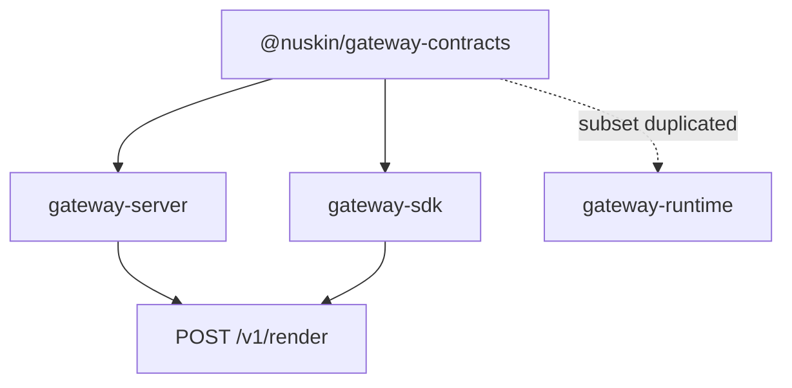
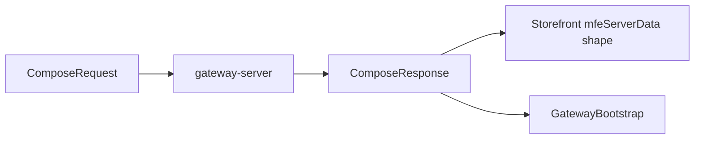

# @nuskin/gateway-contracts

Shared TypeScript types for the MFE Render Gateway. This package has **no runtime logic** — only interfaces used by the server, SDK, and (optionally) host apps.

> **Context:** [Root README — problem & solution](../../README.md#the-problem-before)

## Role in the architecture





Keeping types in one package avoids circular dependencies and ensures the storefront, gateway API, and orchestrator agree on the same request/response shapes.

## What it defines

### Rendering contract (`MfeAdapter`)

Optional hooks an MFE can implement when loaded by the gateway. In practice, **adapters live in `gateway-server`** and call MFE UI via federation; MFE repos do not ship adapter files.

| Method | When used |
|--------|-----------|
| `renderServer(ctx)` | SSR: return HTML (+ optional `state`, `head`, `assets`) |
| `hydrateClient(el, ctx, state?)` | Client: attach to existing SSR markup |
| `mountClient(el, ctx)` | Client: CSR-only mount into placeholder |

### Orchestration types

| Type | Purpose |
|------|---------|
| `ComposeRequest` | What the host sends: `url`, `locale`, `slots[]`, optional `mfeRemoteConfig` |
| `ComposeResponse` | Full compose result: rendered slots, `bootstrap`, `bootstrapScript`, `diagnostics` |
| `SlotRequest` | One slot: `slotId`, `mfeId`, `ssr?`, `params?` |
| `RenderedSlot` | One rendered slot: `html`, `mode` (`ssr` \| `csr` \| `fallback`), `loaderId` |
| `GatewayBootstrap` | JSON payload for the browser (`__MFE_GATEWAY__` script) |
| `GatewayManifest` | Static config per MFE: federation URLs, SSR defaults, fallbacks |
| `MfeRemoteConfigOverride` | ContentStack URLs merged per request from storefront |

### Context types

- **`RenderContext`** — Passed into `renderServer` / client hooks: `requestId`, `url`, `locale`, `params`, `host`, `slotId`.
- **`HostContext`** — Cookies/headers/env from the host request.

## Usage

```typescript
import type {
  ComposeRequest,
  ComposeResponse,
  MfeAdapter,
  GatewayManifest,
} from "@nuskin/gateway-contracts";
```

## Build

```bash
yarn workspace @nuskin/gateway-contracts build
```

Output: `dist/index.js` + `dist/index.d.ts`.

## When to change this package

- Adding a field to compose requests/responses (coordinate with `gateway-server` API and `gateway-sdk`).
- New manifest options (e.g. per-MFE timeout, criticality).
- Extending `MfeRenderResult` (e.g. streaming, partial hydration).

Do **not** put implementation, React, or Express code here — only types.
