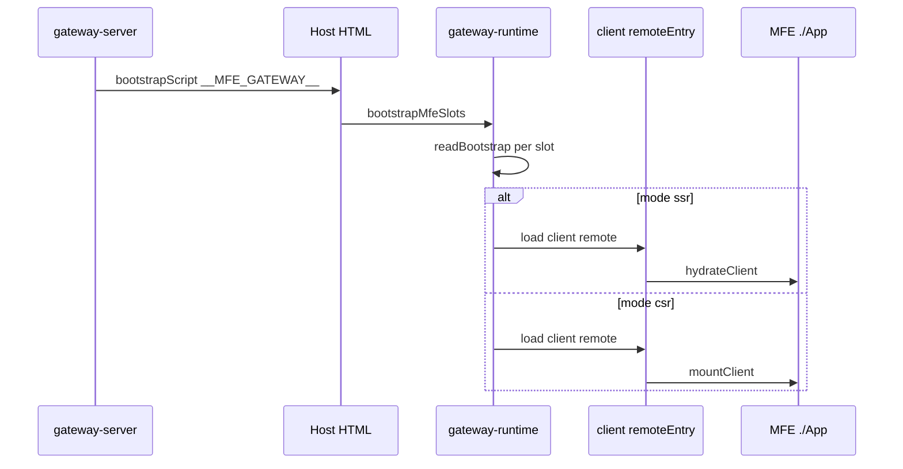
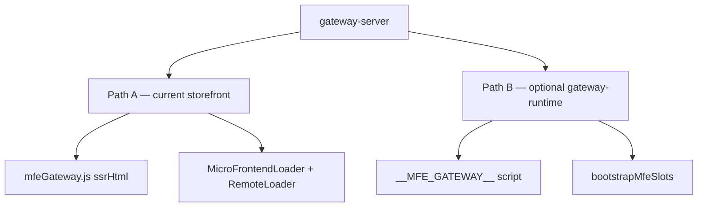

# @nuskin/gateway-runtime

Browser-side runtime for hydrating or mounting MFE slots after the host app loads. Reads the `__MFE_GATEWAY__` bootstrap script emitted by `gateway-server`.

> **Context:** [Root README](../../README.md) · **Optional** — storefront still hydrates with existing `RemoteLoader`; use this when the host should own all slot lifecycle from `__MFE_GATEWAY__`.

## Role in the architecture



### Storefront today vs gateway-runtime



## Current storefront integration

Storefront **does not require** this package today when using the minimal integration path:

- Server: `config/mfeGateway.js` returns legacy-shaped `mfeServerData` (`ssrHtml`, `_clientRemoteConfig`).
- Client: existing `MicroFrontendLoader` + `RemoteLoader` hydrate `./App` like before.

Use **gateway-runtime** when you want a single bootstrap entry that:

- Reads `__MFE_GATEWAY__` from the page
- Initializes all remotes from the bootstrap payload
- Calls `hydrateClient` / `mountClient` per slot automatically

## Exports

### `readBootstrap()`

Parses `#__MFE_GATEWAY__` script content into a `GatewayBootstrap` object.

### `bootstrapMfeSlots(bootstrap?)`

1. For each slot with `mode === "ssr"`: load remote → `hydrateClient(el, ctx, state)`.
2. For each slot with `mode === "csr"`: load remote → `mountClient(el, ctx)`.

Expects:

- Slot elements in the DOM: `[data-mfe-loader-id="{loaderId}"]`
- `window.__FEDERATION__` from `@module-federation/runtime` (normally provided by the host, same as storefront `RemoteLoader`)

### Example (host app)

```typescript
import { bootstrapMfeSlots } from "@nuskin/gateway-runtime";

// After host shell hydrateRoot:
await bootstrapMfeSlots();
```

Or inject `bootstrapScript` from compose response and call after `loadableReady`.

## Bootstrap shape

```json
{
  "version": "1",
  "requestId": "uuid",
  "url": "/us/en/shop",
  "shared": { "locale": { "market": "us", "language": "en" } },
  "slots": [
    {
      "slotId": "header",
      "mfeId": "header_mfe",
      "mode": "ssr",
      "loaderId": "mfe-loader-0-header_mfe",
      "state": { },
      "client": {
        "remoteEntry": "https://cdn.../remoteEntry.js",
        "module": "./App"
      }
    }
  ]
}
```

## When to use

| Scenario | Recommendation |
|----------|----------------|
| Minimal storefront change | **RemoteLoader** only (current) |
| Full gateway-owned client lifecycle | **gateway-runtime** + inject `bootstrapScript` |
| Custom host (non-storefront) | **gateway-runtime** + your shell |

## Build

```bash
yarn workspace @nuskin/gateway-runtime build
```

Browser-only (`DOM` types). No dependency on `gateway-contracts` at runtime (local duplicate types in `src/types.ts` to keep the bundle small).

## Limitations

- Requires Module Federation runtime on `window` (same as storefront).
- MFE remotes must expose modules compatible with hydrate/mount (or host continues using `RemoteLoader` with `./App`).
