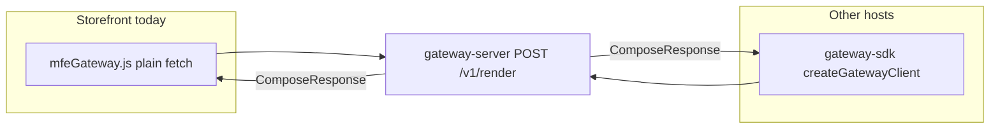
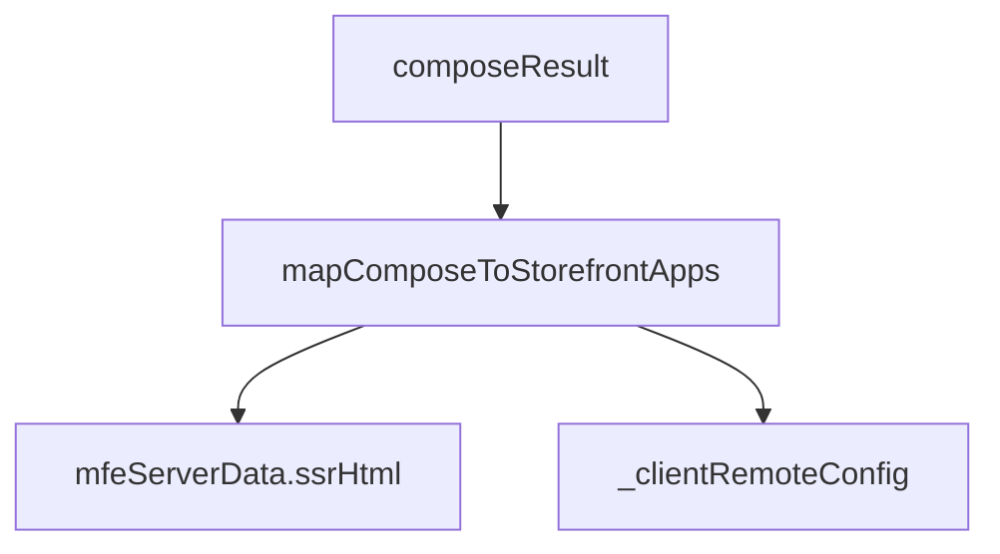

# @nuskin/gateway-sdk

TypeScript client for calling the Render Gateway from Node.js (e.g. storefront server, scripts, tests).

> **Context:** [Root README](../../README.md) · Storefront uses plain `fetch` in `mfeGateway.js` today; this package is the typed alternative for new hosts.

## Role in the architecture





**NuSkin storefront today** uses `storefront/config/mfeGateway.js` (plain `fetch`) instead of this package, to keep storefront dependencies minimal. This SDK is the **typed, reusable** alternative when you want to import the gateway from TypeScript or share compose helpers.

## Exports

### `createGatewayClient(options)`

```typescript
import { createGatewayClient } from "@nuskin/gateway-sdk";

const client = createGatewayClient({
  baseUrl: "http://localhost:3100",
  fetchImpl: fetch, // optional
});

const result = await client.compose({
  url: "/us/en/shop",
  locale: { market: "us", language: "en" },
  slots: [
    { slotId: "header", mfeId: "header_mfe", ssr: true },
  ],
  mfeRemoteConfig: {
    header_mfe: {
      clientEntry: "https://cdn.../remoteEntry.js",
      serverEntry: "https://cdn.../server/remoteEntry.js",
    },
  },
});

await client.getManifest();
```

### `buildComposeRequest()` / `mapComposeToStorefrontApps()`

Helpers in `storefront-bridge.ts` for mapping gateway responses to the legacy storefront shape:

| Legacy field | Source |
|--------------|--------|
| `mfeServerData.ssrHtml` | `ComposeResponse.slots[].html` |
| `mfeServerData._clientRemoteConfig` | Passed through from host |
| `appName`, `mfeComponent: null` | Per slot |

### Types

Re-exports `ComposeRequest`, `ComposeResponse` from `@nuskin/gateway-contracts`.

### `buildPageInjection(result)`

Builds HTML snippets for template injection:

```typescript
const { slotsHtml, headTags, bootstrapScript } = buildPageInjection(result);
```

## When to use this package

| Use SDK | Use plain fetch (`mfeGateway.js`) |
|---------|-----------------------------------|
| New TypeScript services | Existing storefront (minimal deps) |
| Contract tests with types | Already implemented bridge |
| Non-storefront hosts | — |

## Build

```bash
yarn workspace @nuskin/gateway-sdk build
```

Depends on `@nuskin/gateway-contracts` (workspace).

## Example: replace fetch in a Node service

```typescript
import {
  createGatewayClient,
  buildComposeRequest,
  mapComposeToStorefrontApps,
} from "@nuskin/gateway-sdk";

const client = createGatewayClient({ baseUrl: process.env.RENDER_GATEWAY_URL! });

const request = buildComposeRequest({
  appsToRender: [{ remoteConfig: { appName: "header_mfe" }, isToEnableSSR: true }],
  originalUrl: "/us/en/shop",
  locale: { market: "us", language: "en" },
  mfeRemoteConfig: { /* from ContentStack */ },
});

const composeResult = await client.compose(request);
const apps = mapComposeToStorefrontApps({
  composeResult,
  appsToRender: request.slots.map(/* ... */),
  originalUrl: request.url,
  clientRemoteConfigs: {},
});
```
